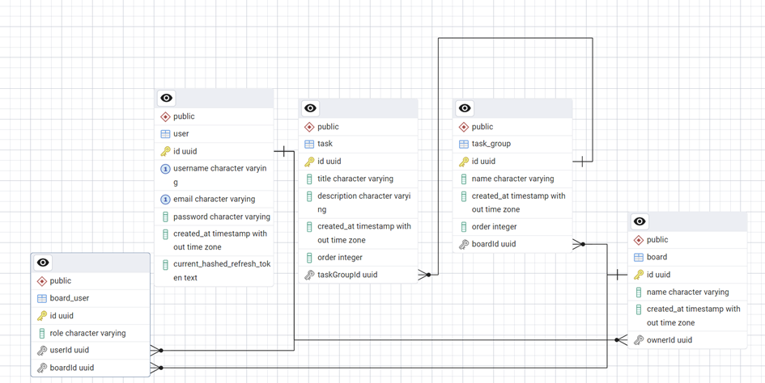

# Task-Board – full-stack task-management app

A Trello-style board that lets teams organise work into **Boards → Task Groups → Tasks** with drag-and-drop ordering.


## Key features

- **Authentication** - JWT (access + refresh) in HttpOnly cookies; refresh-token rotation; role guards (`admin`, `user`).  
- **Task workflow** - CRUD for boards, groups and tasks; order preserved via `order` integer column.  
- **Async jobs** - RabbitMQ publisher / consumer keeps HTTP requests fast.  
- **REST API** - Prefixed with **`/api`**, Swagger docs at `/api/docs`.  
- **Database** - PostgreSQL schema in 3-NF, entities & migrations handled by TypeORM.

## Database schema



<details>
<summary>Table overview</summary>

| Table | Description |
|-------|-------------|
| **user** | Account and profile (stores hashed refresh token). |
| **board** | Top-level container; owned by a user, shareable. |
| **task_group** | Column with tasks on a board. |
| **task** | Individual card task. |
| **board_user** | *M-N* join to share boards with teammates (role per board). |
</details>

## Technologies

- **Frontend**
  - **React 18** – declarative UI library with Hooks and a mature ecosystem
  - **Vite 6** – lightning-fast dev server & production builds
  - **TypeScript 5** – static typing and first-class IDE support

- **Backend**
  - **NestJS 10** – modular, testable Node.js framework (controllers, services, DI)
  - **TypeORM** – object–relational mapper for PostgreSQL; entities, migrations, query builder
  - **Jest** – unit & e2e testing with fast watch mode

- **Database**
  - **PostgreSQL 15** – battle-hardened relational database with rich JSONB and indexing

- **Messaging / other**
  - **RabbitMQ 3** – durable message broker for background tasks and notifications


## Setup

> **Prerequisites**
>
> * Node 18 LTS (or newer)  
> * Yarn (or npm)  
> * Docker Desktop – only to start Postgres + RabbitMQ containers

---

### 1 → Clone the repo
```bash
git clone https://github.com/<your-org>/<repo>.git
backend:
  yarn start:dev
frontend:
  npm run dev
```
App URL: http://localhost:5173
Swagger docs: http://localhost:3000/api/docs


